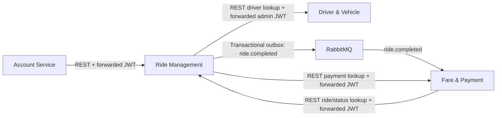

# RideLink microservices

RideLink is split into four independently persisted Spring Boot services. The local Docker Compose stack starts the services, MySQL schemas, PostgreSQL, and RabbitMQ.

## Service map

| Service | Local port | Database | Responsibilities |
| --- | ---: | --- | --- |
| Account Service | 8081 | MySQL `ridelink_account_db` | Registration, login, JWTs, identity lookup |
| Driver & Vehicle Service | 3002 | MySQL `ridelink_driver_db` | Driver profiles, vehicles, driver availability and discovery |
| Ride Management Service | 3003 | PostgreSQL `ridelink_ride_db` | Ride lifecycle, assignment, ride history, event outbox |
| Fare & Payment Service | 3004 | MySQL `ridelink_fare_db` | Fare estimates and the single authoritative payment store |



All services that validate RideLink JWTs use the same `JWT_SECRET`, at least 32 bytes. Driver profiles link to Account Service accounts by UUID. Ride Management validates identities with Account Service and calls Driver & Vehicle during admin assignment. Fare & Payment validates the ride state through the authenticated `GET /api/rides/{rideId}` endpoint.

When a ride becomes `COMPLETED`, Ride Management writes a versioned `ride.completed` event to its PostgreSQL outbox in the same transaction as the status update. A scheduled publisher sends pending events to the durable `ridelink.events` exchange with routing key `ride.completed` and waits for RabbitMQ confirmation. Fare & Payment consumes the event, creates a simulated cash payment, and stores payment records only in its own database. A unique constraint on payment `ride_id` and the consumer's duplicate check make redelivery safe. The receipt endpoint in Ride Management reads the record from Fare & Payment; it can briefly return `PAYMENT_PROCESSING` while the event is being consumed.

The event schema is version `1.0`:

```json
{
  "eventId": "uuid",
  "eventType": "ride.completed",
  "eventVersion": "1.0",
  "occurredAt": "2026-10-03T12:00:00Z",
  "rideId": "uuid",
  "passengerId": "uuid",
  "driverId": "uuid",
  "distanceKm": 12.5,
  "durationMinutes": 25,
  "fareAmount": 2500.00,
  "currency": "LKR"
}
```

The demo consumer simulates a `CASH` payment when it receives the completion event. This keeps payment ownership in Fare & Payment while avoiding charging a real payment method during ride completion. Configure `PAYMENT_TEST_MODE=true` and `PAYMENT_TEST_OUTCOME_SUCCESS=true` for deterministic local runs. Rabbit delivery uses retries and sends repeatedly failing messages to `fare-payment.ride-completed.dlq`.

## Run the complete local stack with Docker

Requires Docker Desktop with Compose. Create a local environment file and set a private JWT secret with at least 32 bytes:

```powershell
Copy-Item .env.example .env
notepad .env
```

Edit `.env`, then build and start the stack from the repository root:

```powershell
docker info
docker compose config --quiet
docker compose up --build -d
docker compose ps
```

Service health URLs are `http://localhost:8081/health`, `http://localhost:3002/health`, `http://localhost:3003/health`, and `http://localhost:3004/health`. RabbitMQ management is at `http://localhost:15672` using the credentials in `.env`.

If a local MySQL installation occupies port 3306, set `MYSQL_HOST_PORT=3307` in `.env`. Container connections continue to use `mysql:3306`; connections from Windows to the Compose database use the configured host port.

Docker builds normalize Gradle launcher line endings for Windows checkouts and share a locked Gradle download cache. The wrappers allow a 60-second network timeout; Account and Driver wrappers also retry distribution downloads. The first build requires access to Docker Hub, Gradle distribution hosting, and Maven repositories; later builds reuse downloaded artifacts.

Inspect logs and stop the stack while retaining data:

```powershell
docker compose logs -f
docker compose down
```

`docker compose down -v` deletes development database and RabbitMQ volumes and their data. Use it only when you intend to reset the stack.

Compose waits for database, broker, and upstream application health checks. Every application exposes unauthenticated `/health`; these endpoints report application availability rather than detailed dependency readiness. The Ride outbox retries unsuccessful publishes, and the Fare consumer retains its retry/dead-letter handling. RabbitMQ data is persisted in `rabbitmq-data`.

If `docker info` or `docker run --rm hello-world` returns HTTP 500 from the `dockerDesktopLinuxEngine` named pipe, this is a Docker Desktop/WSL/Docker Engine environment problem, not a RideLink source-code or Compose problem. Validate Compose separately with `docker compose config --quiet` (avoids printing resolved secrets). Do not change Java code or disable authentication to address this error.

Check Windows WSL status:

```powershell
wsl --status
wsl --version
wsl -l -v
```

Quit Docker Desktop, save work in WSL sessions, then run `wsl --shutdown` (stops all WSL distributions). Reopen Docker Desktop with the WSL 2 engine and Linux containers enabled; wait until it reports running, then retry:

```powershell
docker info
docker run --rm hello-world
```

If it still fails, use Docker Desktop's Troubleshoot menu to restart and gather diagnostics. See [Docker troubleshooting](https://docs.docker.com/desktop/troubleshoot-and-support/troubleshoot/) and [Microsoft WSL commands](https://learn.microsoft.com/en-us/windows/wsl/basic-commands). Do not reset volumes or factory settings as a first recovery step.

The Compose MySQL container initializes the three service schemas on its first start. If you already have a `mysql-data` volume from before those schemas were added, create them once with:

```sql
CREATE DATABASE IF NOT EXISTS ridelink_account_db;
CREATE DATABASE IF NOT EXISTS ridelink_driver_db;
CREATE DATABASE IF NOT EXISTS ridelink_fare_db;
```

Existing Account schemas from the earlier `BINARY(36)` UUID mapping need a one-time correction before identity lookup can work. The guarded migration verifies extra bytes are zero padding, preserves all 16 UUID bytes and all account records, and works when rerun:

```powershell
Get-Content docker/mysql/migrations/001_fix_account_uuid_storage.sql | docker compose exec -T mysql sh -c 'MYSQL_PWD=$MYSQL_ROOT_PASSWORD mysql -uroot ridelink_account_db'
```

Fresh schemas use `BINARY(16)` automatically. Run the correction while application traffic is stopped; do not delete database volumes to fix UUID lookup.

## Run services from the IDE

To run the Java services in four separate PowerShell windows, first run these commands from the project root to stop the application containers and start only their infrastructure (database volumes are retained):

```powershell
docker compose stop account-service driver-vehicle-service ride-management-service fare-payment-service
docker compose up -d --wait mysql ride-postgres rabbitmq
```

In each window, change to the project root and run one of these commands:

```powershell
.\run-service.ps1 account-service
.\run-service.ps1 driver-vehicle-service
.\run-service.ps1 ride-management-service
.\run-service.ps1 fare-payment-service
```

The launcher reads the root `.env` without printing secrets, uses the configured `MYSQL_HOST_PORT`, and overrides container addresses with `localhost`. Start Account and Driver first, then Ride and Fare. Keep the windows open; Ctrl+C stops that window's service. Once all four are ready, run `.\e2e-smoke-test.ps1` from another window. Local launches require Java 21.

Start MySQL with the three schemas, PostgreSQL with `ridelink_ride_db`, and RabbitMQ. Set the variables from `.env.example` in each run configuration. Use these local addresses:

```text
ACCOUNT_SERVICE_URL=http://localhost:8081
DRIVER_SERVICE_URL=http://localhost:3002
RIDE_SERVICE_URL=http://localhost:3003
FARE_PAYMENT_SERVICE_URL=http://localhost:3004
RABBITMQ_HOST=localhost
```

In Docker, Compose sets the equivalent URLs to the service DNS names. Spring does not automatically load `.env` for IDE launches; configure those values in the IDE or shell.

## End-to-end smoke flow

1. Register a passenger and driver through Account Service; log in to obtain their JWTs and UUIDs.
   The local Compose example configures an initial ADMIN account through `ADMIN_BOOTSTRAP_USERNAME`, `ADMIN_BOOTSTRAP_EMAIL`, and `ADMIN_BOOTSTRAP_PASSWORD`; all three must be set together and the password must be at least 12 characters. Account Service hashes the password and never exposes a public admin registration route. Log in as that admin to create the driver profile and assign rides.
2. Create the driver's operational profile in Driver & Vehicle Service with the driver account UUID, a service area, and location. Use an admin JWT for profile creation; use the driver's JWT for self-service availability/location changes.
3. Create a ride with the passenger JWT. The optional `serviceArea` is required when `DRIVER_SERVICE_AREA_CHECK=true`.
4. Assign the ride with an admin JWT. Ride Management requests available drivers using the forwarded admin JWT.
5. Accept, start, and complete the ride with its assigned driver's JWT.
6. Verify the payment in Fare & Payment at `GET http://localhost:3004/api/v1/payments/ride/{rideId}` with the passenger or driver JWT. Verify the ride receipt at `GET http://localhost:3003/api/rides/{rideId}/receipt`.
7. Check the RabbitMQ queue `fare-payment.ride-completed` for pending work, or the dead-letter queue for events that failed after retries.

The smoke test reads credentials in this order: explicit parameters, process environment, then the repository-root `.env` beside the script. Compose also reads `.env`; you do not need to import credentials into PowerShell:

```powershell
.\e2e-smoke-test.ps1
```

You can override credentials with `-AdminUsername 'admin' -AdminPassword '<your-password>'` or process environment variables. Keep them aligned with Account Service: changing bootstrap configuration does not reset an existing admin's password. All three bootstrap fields (including email) are required when creating the first admin.

The script checks all four `/health` endpoints first, assigns the driver created by this run, polls for up to 60 seconds for exactly one successful cash payment, and verifies the matching receipt. Configure bounded waits with `-HealthTimeoutSeconds` and `-PaymentTimeoutSeconds`. Repeated reads check the single payment remains stable; the script does not replay broker events. Consumer unit tests cover duplicate processing. The `.env` parser supports blank lines, comments, first-`=` splitting, and simple literal quoted values; it never executes the file, expands variable references, or prints passwords. Use literal credentials and single quotes for values containing `$`.

Import each service's Postman collection under its `postman` folder for request examples. The Fare & Payment collection documents a simulated payment request; the ride-completion consumer creates the local demo payment automatically, and duplicate payment creation for one ride is rejected.

## Checks

Run the wrapper in each service directory:

```powershell
cd account-service; .\gradlew.bat check
cd ..\driver-vehicle-service; .\gradlew.bat check
cd ..\ride-management-service; .\gradlew.bat check
cd ..\fare-payment-service; .\gradlew.bat check
```

Ride Management also has JavaScript tests: `npm.cmd run test:js` from `ride-management-service`.

Run offline smoke-script regression checks from the root with `.\tests\e2e-smoke-test.tests.ps1`. These mock API responses and do not verify live containers or RabbitMQ delivery.

## Configuration reference

Set `JWT_SECRET`, the service database credentials (`ACCOUNT_DB_*`, `DRIVER_DB_*`, `RIDE_DB_*`, `FARE_DB_*`), service URLs (`ACCOUNT_SERVICE_URL`, `DRIVER_SERVICE_URL`, `RIDE_SERVICE_URL`, `FARE_PAYMENT_SERVICE_URL`), and RabbitMQ (`RABBITMQ_HOST`, `RABBITMQ_PORT`, `RABBITMQ_USERNAME`, `RABBITMQ_PASSWORD`). `DRIVER_SERVICE_AREA_CHECK` defaults to `false`. `RIDE_EVENTS_EXCHANGE`, `RIDE_COMPLETED_ROUTING_KEY`, `RIDE_COMPLETED_QUEUE`, and dead-letter exchange/queue names have defaults in each service's `application.properties`.

Local Compose credentials are for development only. Change them before using the stack in a shared or deployed environment.
